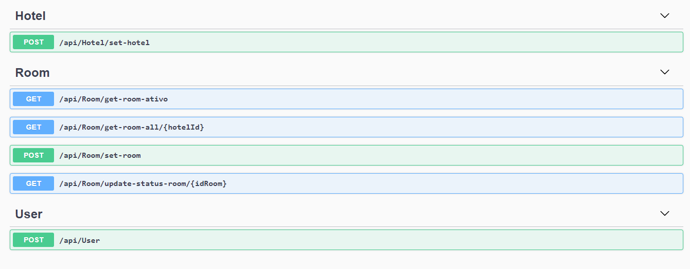

<h1 align="center">Sistema de Reserva de Hotel</h1><!--Nome curto e objetivo-->
<h5 align="center">Status: Em andamento</h5><!--Concluido, Em andamento ou Finalizado-->

<h2>Sumário</h2>
<!--Sumário que leva as sessões do readme-->
<ul>
    <li><a href="#sobre">Sobre</a></li>
    <li><a href="#requisitosmacro">Requisitos macro</a></li>
    <li><a href="#demo">Demonstração da aplicação</a></li>
    <li><a href="#prereq">Pré-requisitos e como rodar a aplicação</a></li>
    <li><a href="#tec">Tecnologias utilizadas</a></li>
    <li><a href="#autor">Responsáveis</a></li>
</ul>

<h2 id="sobre">💻 Sobre</h2>
<!--Descrição do contexto e produto do projeto - Consulte o documento F001-NDSI-Levantamento de Macro Requisitos-->

O produto consiste em um sistema de reserva de hotel, em que há dois usuário, um hotel e outro cliente, o hotel é capaz de gerenciar os quartos do hotel se estão disponiveis ou não, já o usuário cliente consulta os quartos disponíveis.

<h2 id="requisitosmacro">📝 Requisitos macro</h2>
<!--Lista de todos as funcionalidades do sistema (nível macro)-->
<ul>
    <li>Cadastrar hotel [set-hotel]: (name, Descrition, CNPJ, CEP, Address)</li>
    <li>Consultar quartos ativos [get-room-ativo]: (não tem parametros)</li>
    <li>Consultar todos os quartos de um hotel [get-room-all/{hotelId}]: (há o parametro do ID do hotel) </li>
    <li>Cadastrar quarto de um hotel [set-room]:  (RoomNumber, Floor, HotelID, Status)</li>
    <li>Efetuar login [user]: (Email, Password)*</li>
</ul>
*Os usuários são criados direto no banco, não deu tempo de implementar tudo.

<h2 id="demo">🎥 Demonstração da aplicação</h2>
<!--Conjunto de prints da aplicação-->
<h1 align="center">
    
</h1>

<h2 id="prereq">📀 Pré-requisitos e como rodar a aplicação</h2>
<!--Descrição do pré requisito de instalação na maquina em forma de passo a passo-->
<ol>
    <li>Instale na sua maquina o .NET 5 + SQL SERVER 2014</li>
    <li>Instale o SQL Management Studio (banco de dados)</li>
    <li>Instale o visual Studio 2019</li>
    <li>Clone o projeto na sua maquina</li>
    <li>Defina a API como projeto de inicialização</li>
    <li>Faça build em toda a solução</li>
   <li>Altere a string de conexão em appsettings.Development</li>
    <li>Acesse o visual studio/ferramentas/gerenciador de pacote Nuget/console do gerenciador de pacote, com isso digite update-database</li>
    <li>Click no botão de executar e selecione IIS Express (botão verde com icone parecido com do youtube)</li>
</ol>

<h2 id="tec">🔨Tecnologias utilizadas</h2>
<!--Descrição das tecnologias utilizadas (linguagem, biblioteca, framework etc)-->

As seguintes ferramentas foram utilizadas na construção do projeto:

<ul>
    <li>.NET 5 SDK</li>
    <li>C#</li>
    <li>SQL SERVER 2014</li>
</ul>

<h2 id="autor">👦 Responsáveis</h2>
<!--Listagem dos responsáveis pelo projeto-->
<ul>
   <li>Patrick Guilherme</li>
   <li>João Pedro </li>
   <li>Natália</li>
<ul>
